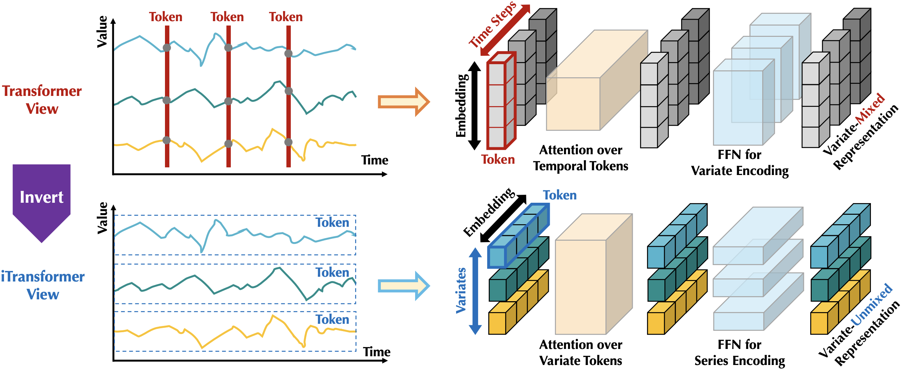
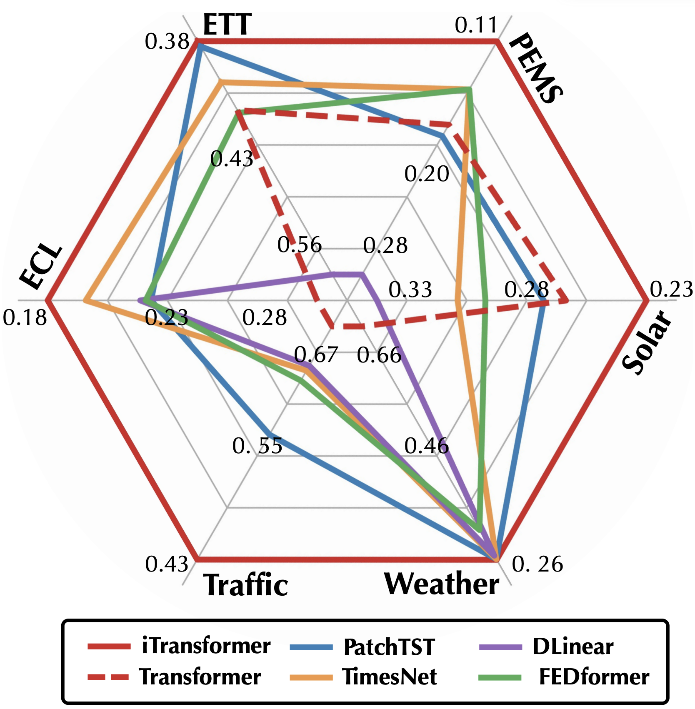
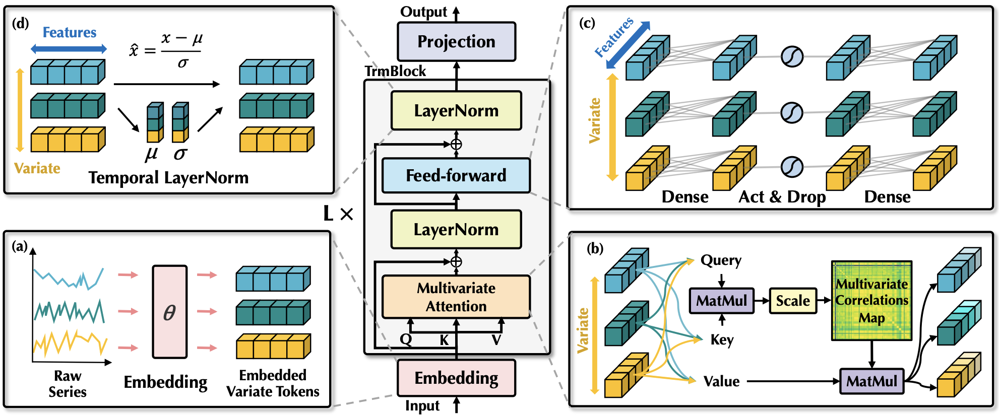
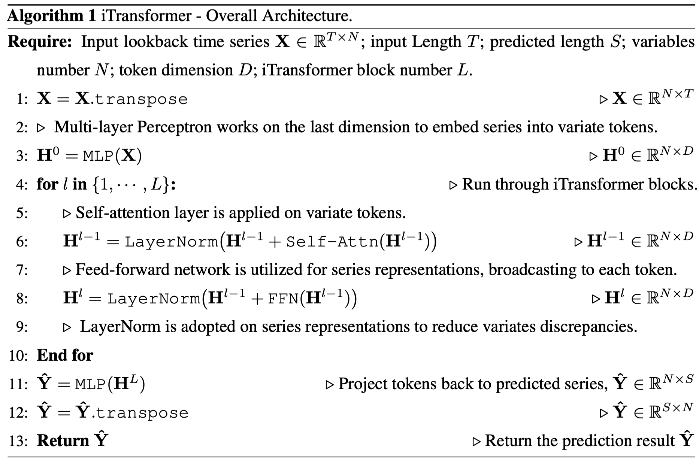
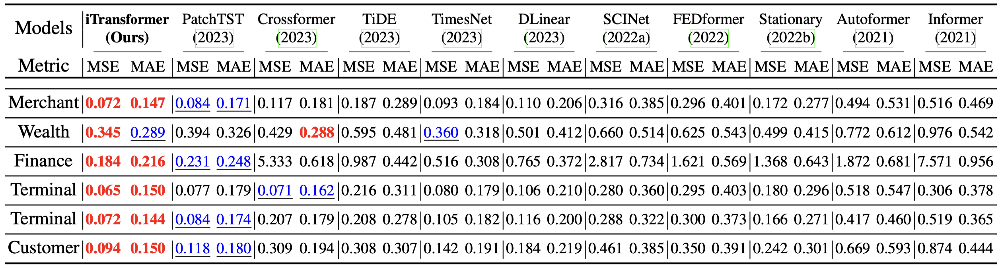
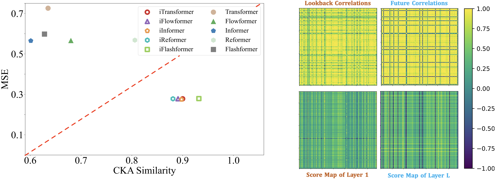

# iTransformer

The repo is the official implementation for the paper: [iTransformer: Inverted Transformers Are Effective for Time Series Forecasting](https://arxiv.org/abs/2310.06625). [[Slides]](https://cloud.tsinghua.edu.cn/f/175ff98f7e2d44fbbe8e/), [[Poster]](https://cloud.tsinghua.edu.cn/f/36a2ae6c132d44c0bd8c/).


# Updates

:triangular_flag_on_post: **News** (2024.10) [TimeXer](https://arxiv.org/abs/2402.19072), a Transformer for predicting with exogenous variables, is released. Code is available [here](https://github.com/thuml/TimeXer). 

:triangular_flag_on_post: **News** (2024.05) Many thanks for the great efforts from [lucidrains](https://github.com/lucidrains/iTransformer). A pip package for the usage of iTransformer variants can be simply installed via ```pip install iTransformer```

:triangular_flag_on_post: **News** (2024.04) iTransformer has benn included in [NeuralForecast](https://github.com/Nixtla/neuralforecast/blob/main/neuralforecast/models/itransformer.py). Special thanks to the contributor @[Marco](https://github.com/marcopeix)!

:triangular_flag_on_post: **News** (2024.03) Introduction of our work in [Chinese](https://mp.weixin.qq.com/s/-pvBnA1_NSloNxa6TYXTSg) is available.

:triangular_flag_on_post: **News** (2024.02) iTransformer has been accepted as **ICLR 2024 Spotlight**.

:triangular_flag_on_post: **News** (2023.12) iTransformer available in [GluonTS](https://github.com/awslabs/gluonts/pull/3017) with probablistic head and support for static covariates. Notebook is available [here](https://github.com/awslabs/gluonts/blob/dev/examples/iTransformer.ipynb).

:triangular_flag_on_post: **News** (2023.12) We received lots of valuable suggestions. A [revised version](https://arxiv.org/pdf/2310.06625v2.pdf) (**24 Pages**) is now available.

:triangular_flag_on_post: **News** (2023.10) iTransformer has been included in [[Time-Series-Library]](https://github.com/thuml/Time-Series-Library) and achieves state-of-the-art in Lookback-$96$ forecasting.

:triangular_flag_on_post: **News** (2023.10) All the scripts for the experiments in our [paper](https://arxiv.org/pdf/2310.06625.pdf) are available.


## Introduction

🌟 Considering the characteristics of multivariate time series, iTransformer breaks the conventional structure without modifying any Transformer modules. **Inverted Transformer is all you need in MTSF**.

<p align="center">

</p>

🏆 iTransformer achieves the comprehensive state-of-the-art in challenging multivariate forecasting tasks and solves several pain points of Transformer on extensive time series data.

<p align="center">

</p>


## Overall Architecture

iTransformer regards **independent time series as variate tokens** to **capture multivariate correlations by attention** and **utilize layernorm and feed-forward networks to learn series representations**.

<p align="center">

</p>

The pseudo-code of iTransformer is as simple as the following:

<p align="center">

</p>

## Usage 

1. Install Pytorch and necessary dependencies.

```
pip install -r requirements.txt
```

1. The datasets can be obtained from [Google Drive](https://drive.google.com/file/d/1l51QsKvQPcqILT3DwfjCgx8Dsg2rpjot/view?usp=drive_link) or [Baidu Cloud](https://pan.baidu.com/s/11AWXg1Z6UwjHzmto4hesAA?pwd=9qjr).

2. Train and evaluate the model. We provide all the above tasks under the folder ./scripts/. You can reproduce the results as the following examples:

```
# Multivariate forecasting with iTransformer
bash ./scripts/multivariate_forecasting/Traffic/iTransformer.sh

# Compare the performance of Transformer and iTransformer
bash ./scripts/boost_performance/Weather/iTransformer.sh

# Train the model with partial variates, and generalize on the unseen variates
bash ./scripts/variate_generalization/ECL/iTransformer.sh

# Test the performance on the enlarged lookback window
bash ./scripts/increasing_lookback/Traffic/iTransformer.sh

# Utilize FlashAttention for acceleration
bash ./scripts/efficient_attentions/iFlashTransformer.sh
```

## Main Result of Multivariate Forecasting

We evaluate the iTransformer on challenging multivariate forecasting benchmarks (**generally hundreds of variates**). **Comprehensive good performance** (MSE/MAE $\downarrow$) is achieved.


### Online Transaction Load Prediction of Alipay Trading Platform (Avg Results) 

<p align="center">

</p>

## General Performance Boosting on Transformers

By introducing the proposed framework, Transformer and its variants achieve **significant performance improvement**, demonstrating the **generality of the iTransformer approach** and **benefiting from efficient attention mechanisms**.

<p align="center">

</p>

## Zero-Shot Generalization on Variates

**Technically, iTransformer is able to forecast with arbitrary numbers of variables**. We train iTransformers on partial variates and forecast unseen variates with good generalizability.

<p align="center">

</p>

## Model Analysis

Benefiting from inverted Transformer modules: 

- (Left) Inverted Transformers learn **better time series representations** (more similar [CKA](https://github.com/jayroxis/CKA-similarity)) favored by forecasting.
- (Right) The inverted self-attention module learns **interpretable multivariate correlations**.

<p align="center">

</p>

## Citation

If you find this repo helpful, please cite our paper. 

```
@article{liu2023itransformer,
  title={iTransformer: Inverted Transformers Are Effective for Time Series Forecasting},
  author={Liu, Yong and Hu, Tengge and Zhang, Haoran and Wu, Haixu and Wang, Shiyu and Ma, Lintao and Long, Mingsheng},
  journal={arXiv preprint arXiv:2310.06625},
  year={2023}
}
```

## Acknowledgement

We appreciate the following GitHub repos a lot for their valuable code and efforts.
- Reformer (https://github.com/lucidrains/reformer-pytorch)
- Informer (https://github.com/zhouhaoyi/Informer2020)
- FlashAttention (https://github.com/shreyansh26/FlashAttention-PyTorch)
- Autoformer (https://github.com/thuml/Autoformer)
- Stationary (https://github.com/thuml/Nonstationary_Transformers)
- Time-Series-Library (https://github.com/thuml/Time-Series-Library)
- lucidrains (https://github.com/lucidrains/iTransformer)

This work was supported by Ant Group through the CCF-Ant Research Fund, and awarded as [Outstanding Projects of CCF Fund](https://mp.weixin.qq.com/s/PDLNbibZD3kqhcUoNejLfA).

## Contact

If you have any questions or want to use the code, feel free to contact:
* Yong Liu (liuyong21@mails.tsinghua.edu.cn)
* Haoran Zhang (z-hr20@mails.tsinghua.edu.cn)
* Tengge Hu (htg21@mails.tsinghua.edu.cn)
