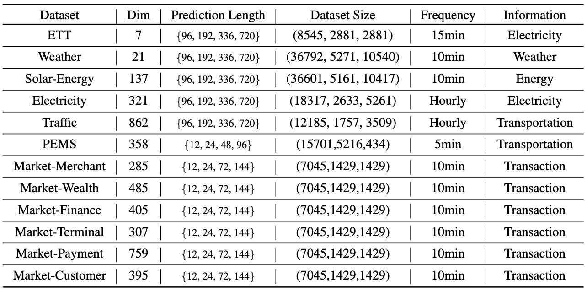
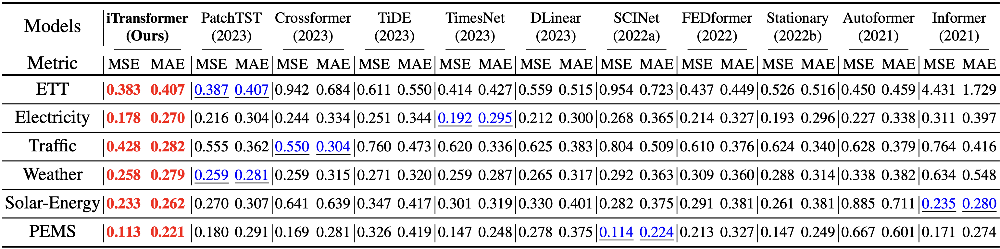
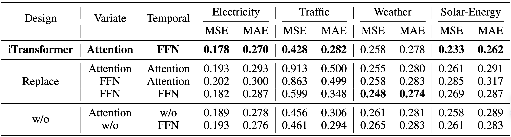
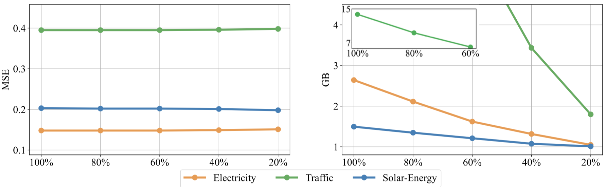

# iTransformer

The repo is the official implementation for the paper: [iTransformer: Inverted Transformers Are Effective for Time Series Forecasting](https://arxiv.org/abs/2310.06625). It currently includes code implementations for the following tasks:

> **Multivariate Forecasting**: We provide all scripts as well as datasets for the reproduction of forecasting results in this repo.

> **Boosting Forecasting of Transformers**: We are continuously incorporating Transformer variants. If you are interested in how well your inverted Transformer works for forecasting tasks, feel free to raise issues.

> **Generalization on Unseen Variates**: iTransformer is demonstrated to generalize well on unseen time series, making it a nice alternative as the fundamental backbone of the large time series model.

> **Better Utilization of Lookback Windows**: While Transformer does not necessarily benefit from the larger lookback window, iTransformer exhibits better utilization of the enlarged lookback window.

> **Adopt Efficient Attention and Training Strategy**: Efficient attention mechanisms as well as the feasibility of extrapolating variates can be leveraged to reduce the complexity when the number of variates is tremendous.
 
# Updates

:triangular_flag_on_post: **News** (2023.10) All the scripts for the above tasks in our [paper](https://arxiv.org/pdf/2310.06625.pdf) are available in this repo.

:triangular_flag_on_post: **News** (2023.10) iTransformer has been included in [[Time-Series-Library]](https://github.com/thuml/Time-Series-Library) and achieve the consistent state-of-the-art in long-term time series forecasting.


## Introduction

🌟 Considering the characteristics of time series, iTransformer breaks the conventional model structure without the burden of modifying any Transformer modules. **Inverting Transformer**  is all you need in MTSF.

<p align="center">

</p>

🏆 iTransformer takes an **overall lead** in complex time series forecasting tasks and solves several pain points of Transformer modeling extensive time series data.

<p align="center">

</p>

😊 **iTransformer** is repurposed on the vanilla Transformer. We think the "passionate modification" of Transformer has got too much attention in the research area of time series. Hopefully, the mainstream work in the following can focus more on the dataset infrastructure and consider the scale-up ability of Transformer.


## Overall Architecture

iTransformer regards **independent time series as tokens** to **capture multivariate correlations by attention** and **utilize layernorm and feed-forward networks to learn better representations** for forecasting.

<p align="center">

</p>

And the pseudo-code of iTransformer is as simple as the following:

<p align="center">

</p>

## Usage 

1. Install Pytorch and other necessary dependencies.

```
pip install -r requirements.txt
```

1. The datasets can be obtained from [Google Drive](https://drive.google.com/file/d/1l51QsKvQPcqILT3DwfjCgx8Dsg2rpjot/view?usp=drive_link) or [Tsinghua Cloud](https://cloud.tsinghua.edu.cn/f/2ea5ca3d621e4e5ba36a/).

2. Train and evaluate the model. We provide all the above tasks under the folder ./scripts/. You can reproduce the results as the following examples:

```
# Task: Multivariate forecasting with iTransformer
bash ./scripts/multivariate_forecast/Traffic/iTransformer.sh

# Task: Compare the performance of Transformer and iTransformer
bash ./scripts/boost_performance/Weather/iTransformer.sh

# Task: Train the model with partial variates, and generalize on the unseen variates
bash ./scripts/variate_generalization/Electricity/iTransformer.sh

# Task: Test the performance on the enlarged lookback window
bash ./scripts/increasing_lookback/Traffic/iTransformer.sh

# Task: Utilize FlashAttention for acceleration (hardware-friendly and almost computationally equivalent to Transformer)
bash ./scripts/efficient_attentions/iFlashTransformer.sh
```

## Main Result of Multivariate Forecasting
We evaluate the iTransformer on six challenging multivariate forecasting benchmarks as well as the server load prediction of Alipay online transactions (**generally hundreds of variates**, denoted as *Dim*). **Consistent least prediction errors** (MSE/MAE) are achieved by iTransformer.

<p align="center">

</p>

### Challenging Multivariate Time Series Forecasting Benchmarks (Avg Results)

<p align="center">

</p>

### Online Transaction Load Prediction of Alipay Trading Platform (Avg Results) 

<p align="center">

</p>

## General Performance Boosting on Transformers

By introducing the proposed framework, Transformer and its variants achieve **significant performance improvement**, demonstrating the generality of the iTransformer approach and the feasibility of **benefiting from efficient attention mechanisms**.

<p align="center">

</p>

## Generalization on Unseen Variates

**Technically, iTransformer can forecast with arbitray number of variables** during inference. We also dive into the capability, which further exhibit that iTransformer **achieves smaller generalization errors** compared with [Channel-independence](https://arxiv.org/pdf/2211.14730.pdf) when only partial variates are used for training.

<p align="center">

</p>

## Better Utilization of Lookback Windows

While previous Transformers do not necessarily benefit from the increase of historical observation. iTransformers show a surprising **improvement in forecasting performance with the increasing length of the lookback window**.

<p align="center">

</p>

## Model Analysis

Benefiting from inverted Transformer modules: 

- (Left) Inverted Transformers learn **better time series representations** (more similar [CKA](https://github.com/jayroxis/CKA-similarity)) favored by time series forecasting.
- (Right) The inverted self-attention module learns **interpretable multivariate correlations**.

<p align="center">

</p>

## Model Abalations

iTransformer that utilizes attention on variate dimensions and feed-forward on temporal dimension generally achieves the best performance. However, the performance of vanilla Transformer (the third row) performs the worst among these designs, **indicating the disaccord of responsibility when the conventional architecture is adopted**.

<p align="center">

</p>

## Model Efficiency

iTransformer achieves **efficiency improvement** over previous [Channel-independence](https://arxiv.org/pdf/2211.14730.pdf) mechanism. We further propose a training strategy for multivariate series by taking advantage of its variate generation ability. While the performance (Left) remains stable on partially trained variates of each batch with the sampled ratios, the memory footprint (Right) of the training process can be cut off significantly.

<p align="center">

</p>


## Citation

If you find this repo helpful, please cite our paper. 

```
@article{liu2023itransformer,
  title={iTransformer: Inverted Transformers Are Effective for Time Series Forecasting},
  author={Liu, Yong and Hu, Tengge and Zhang, Haoran and Wu, Haixu and Wang, Shiyu and Ma, Lintao and Long, Mingsheng},
  journal={arXiv preprint arXiv:2310.06625},
  year={2023}
}
```

## Future Work

- [ ] iTransformer for other time series tasks.
- [ ] Integrating more Transformer variants.

## Acknowledgement

We appreciate the following GitHub repos a lot for their valuable code and efforts.
- Reformer (https://github.com/lucidrains/reformer-pytorch)
- Informer (https://github.com/zhouhaoyi/Informer2020)
- FlashAttention (https://github.com/shreyansh26/FlashAttention-PyTorch)
- Autoformer (https://github.com/thuml/Autoformer)
- Stationary (https://github.com/thuml/Nonstationary_Transformers)
- Time-Series-Library (https://github.com/thuml/Time-Series-Library)

## Contact

If you have any questions or want to use the code, feel free to contact:
* Yong Liu (liuyong21@mails.tsinghua.edu.cn)
* Haoran Zhang (z-hr20@mails.tsinghua.edu.cn)
