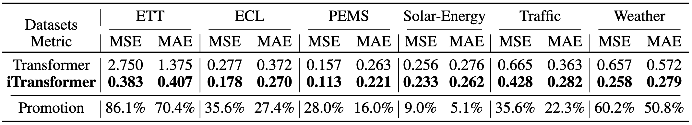
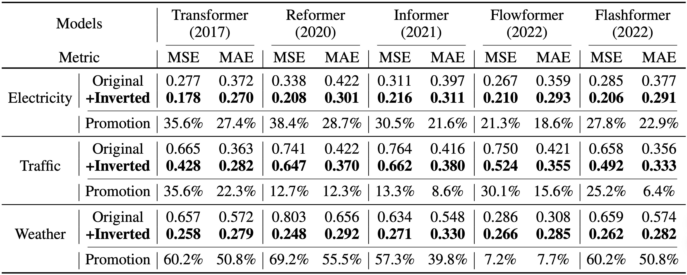

# Inverted Transformers Work Better for Time Series Forecasting

This folder contains the comparison of the vanilla Transformer-based forecasters and the inverted versions. If you are new to this repo, we recommend you to have a look at this [README](../multivariate_forecasting/README.md) first.

## Scripts

In each folder named after the dataset, we compare the performance of iTransformers and the vanilla Transformers.

```
# iTransformer on the Traffic Dataset with gradually enlarged lookback windows.

bash ./scripts/boost_performance/Traffic/iTransformer.sh
```

You can change the ```model_name``` in the script to select one Transformer variant and its inverted version.

## Results
We compare the performance of Transformer and iTransformer on all six datasets, indicating that the attention and feed-forward network on the
inverted dimensions greatly empower Transformers in multivariate time series forecasting.

<p align="center">

</p>

We apply the proposed inverted framework to Transformer and its variants. It demonstrates that our iTransformers framework can consistently promote these Transformer variants,
and take advantage of the booming efficient attention mechanisms.
<p align="center">

</p>
