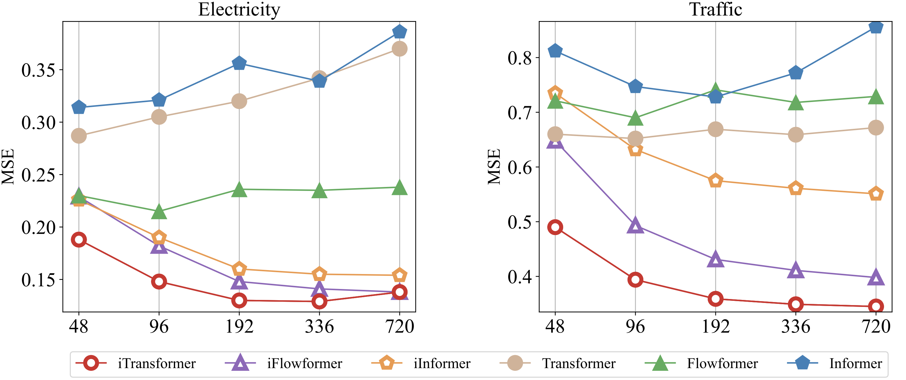

# iTransformer for Enlarged Lookback Window

This folder contains the implementation of the iTransformer for an enlarged lookback window. If you are new to this repo, we recommend you to read this [README](../multivariate_forecasting/README.md) first.

## Scripts

In each folder named after the dataset, we provide the iTransformers and the vanilla Transformers experiments under five increasing prediction lengths.

```
# iTransformer on the Traffic Dataset with gradually enlarged lookback windows.

bash ./scripts/increasing_lookback/Traffic/iTransformer.sh
```

You can change the ```model_name``` in the script to switch the selection of the vanilla Transformer and the inverted version.

## Results

<p align="center">

</p>

The inverted framework empowers Transformers with improved performance on the enlarged lookback window.