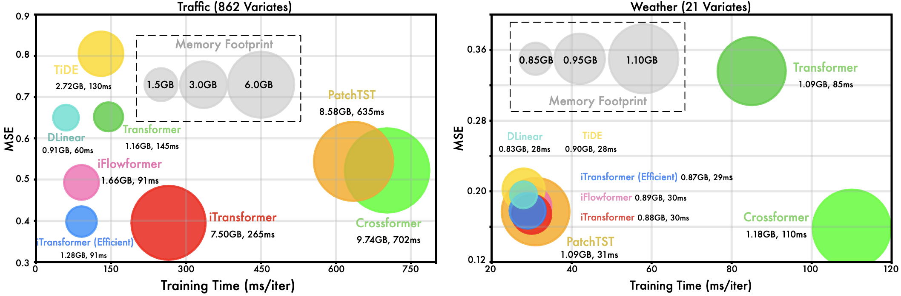

# Efficiency Improvement of iTransformer

Supposing the input multivariate time series has a shape of $T \times N$. The vanilla attention module has a complexity of $\mathcal{O}(L^2)$, where $L$ is the number of tokens. 

* In Transformer, we have $L=T$ because of the manner of time points as tokens. 
* In iTransformer, we have $L=N$ because of the manner of variates as tokens. 

## Benefit from Efficient Attention

Since the attention mechanism is applied on the variate dimension in the inverted structure, efficient attention with reduced complexity essentially addresses the problem of numerous variates, which is ubiquitous in real-world applications.

We currently try out the linear complexity attention from [Flowformer](https://github.com/thuml/Flowformer), and the hardware-accelerated attention mechanism from [FlashAttention](https://github.com/shreyansh26/FlashAttention-PyTorch). It demonstrates efficiency improvement by adopting these novel attention mechanisms.

### Scripts 
We provide the iTransformers with the FlashAttention module:

```
# iTransformer on the Traffic Dataset with hardware-friendly FlashAttention for acceleration

bash ./scripts/model_efficiency/Traffic/iFlashTransformer.sh
```


## Efficient Training Strategy
With the input flexibility of attention, the token number can vary from training to inference, **our model is the first one to be capable of training on arbitrary numbers of series**. We propose a novel training strategy for high-dimensional multivariate series by taking advantage of the [variate generation capability](../variate_generalization/README.md). 

Concretely, we randomly choose part of the variates in each batch and only train the model with selected variates. Since the number of variate channels is flexible because of our inverting, the model can predict all the variates for predictions.


## Results

**Environments**: The batch size of training is fixed as 16 with comparable model hyperparameters. The experiments run on P100 (16G). We comprehensively compare the training speed, memory footprint, and performance of the following.

<p align="center">

</p>

* The efficiency of iTransformer exceeds other Transformers in Weather with 21 variates. In Traffic with 862 variates, the memory footprints are basically the same, but iTransformer can be trained faster.
* iTransformer achieves particularly better performance on the dataset with numerous variates, since the multivariate correlations can be explicitly utilized.
* By adopting an efficient attention module or our proposed efficient training strategy on partial variates, iTransformer can enjoy the same level of speed and memory footprint as linear forecasters.