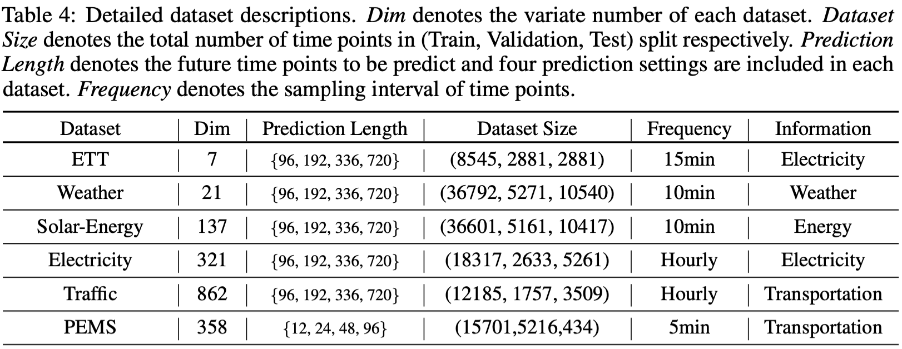

# iTransformer for Multivariate Time Series Forecasting

This folder contains the implementation of the iTransformer for Multivariate Time Series Forecasting (MTSF).

## Dataset

Six challenging multivariate forecasting tasks are evaluated as the benchmark. We provide the download links: [Google Drive](https://drive.google.com/file/d/1l51QsKvQPcqILT3DwfjCgx8Dsg2rpjot/view?usp=drive_link) or [Tsinghua Cloud](https://cloud.tsinghua.edu.cn/f/2ea5ca3d621e4e5ba36a/).

<p align="center">

</p>

## Scripts

In each folder named after the dataset, we provide the iTransformer experiments under four different prediction lengths as shown in the table above.

```
# iTransformer on the Traffic Dataset

bash ./scripts/multivariate_forecast/Traffic/iTransformer.sh
```

To evaluate the model under other input/prediction length, feel free to change the ```seq_len``` and ```pred_len``` arguments:

```
# iTransformer on the Electricity Dataset, where 180 time steps are inputed as the observations and the task is to predict the future 60 steps

python -u run.py \
  --is_training 1 \
  --root_path ./dataset/electricity/ \
  --data_path electricity.csv \
  --model_id ECL_180_60 \
  --model $model_name \
  --data custom \
  --features M \
  --seq_len 180 \
  --pred_len 60 \
  --e_layers 3 \
  --enc_in 321 \
  --dec_in 321 \
  --c_out 321 \
  --des 'Exp' \
  --d_model 512 \
  --d_ff 512 \
  --batch_size 16 \
  --learning_rate 0.0005 \
  --itr 1
```


## Training on Custom Dataset

To train with your own time series dataset, you can try out the following steps:

1. Read through the ```Dataset_Custom``` class under the ```data_provider/data_loader``` folder, which provides the functionality to load and process time series files.
2. The file should be ```csv``` format with the first column contains the timestamp and the following columns contain the variates of time series.
3. Set ```data=custom``` and modifiy the ```enc_in```, ```dec_in```, ```c_out``` arguments acoording to your number of variates in the training script.
