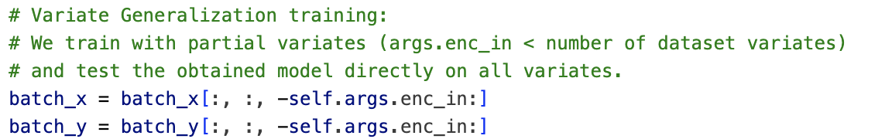
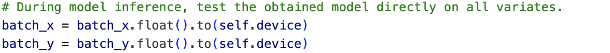
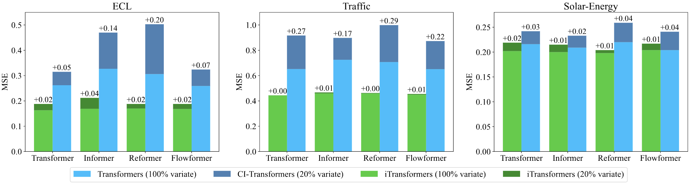

# iTransformer for Variate Generalization

This folder contains the implementation of the iTransformer to generalize on unseen variates. If you are new to this repo, we recommend you to read this [README](../multivariate_forecasting/README.md) first.

By inverting vanilla Transformers, the model is empowered with the generalization capability on unseen variates. Firstly, benefiting from the flexibility of the number of input tokens, the amount of variate channels is no longer restricted and thus feasible to vary from training and inference. Second, feed-forward networks are identically applied on independent variate tokens to learn transferable representations of time series.

## Scripts

```
# Train models with only 20% of variates from Traffic and test the model on all variates without finetuning

bash ./scripts/variate_generalization/Traffic/iTransformer.sh
```

> During Training
<p align="center">

</p>

> During Inference
<p align="center">

</p>

In each folder named after the dataset, we provide two strategies to enable Transformers to generalize on unseen variate.

* **CI-Transformers**: Channel Independence regards each variate of time series as independent channels, and uses a shared backbone to forecast all variates. Therefore, the model can predict variates one by one, but the training and inference procedure can be time-consuming.

* **iTransformers**: benefiting from the flexibility of attention that the number of input tokens can be dynamically changeable, the amount of variates as tokens is no longer restricted, and can even allow the model to be trained on arbitrary variables.

## Results

<p align="center">

</p>

 iTransformers can be naturally trained with 20% variates and accomplish forecast on all variates with the ability to learn transferable representations.